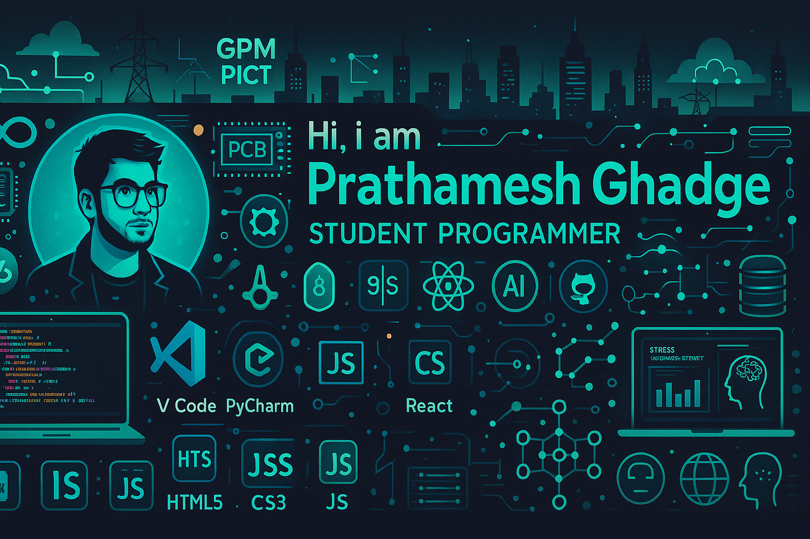

<!-- TOP GLOWING HEADER BANNER -->

  

<!-- DYNAMIC TYPING SVG -->

  

<!-- MAIN CUSTOM POSTER / BANNER -->

  

 

<!-- TERMINAL ABOUT ME SECTION -->
<table border="0" cellspacing="0" cellpadding="0" width="100%">
  <tr>
    <td width="55%" valign="top">
      
        
      <code><b>ROOT@PRATHAM:~$</b> init_developer_matrix.sh</code>
        
      🤖 <b>AI & ML Focus:</b> Building Intelligent Apps with RAG, LangChain, & Recommendation Systems. 
      ⚙️ <b>Full-Stack Engine:</b> React, Next.js, Node.js, FastAPI, Flask & Tailwind CSS. 
      🔬 <b>R&D Stack:</b> Redux Toolkit, Deep Data Analytics & Distributed Systems. 
      🌐 <b>Live Matrix:</b> <a href="https://pratham-ghadge-portfolio.vercel.app"><b>pratham-ghadge-portfolio.vercel.app</b></a> 
      📫 <b>Direct Signal:</b> <code>prathamtech24@gmail.com</code>
        
      <!-- SOCIAL BUTTONS -->
      
      
      
    </td>
    <td width="5%" valign="top"></td>
    <td width="40%" align="center" valign="middle">
      <!-- FUTURISTIC HIGH-TECH GIF -->
      
    </td>
  </tr>
</table>

 

<!-- TECH VAULT & CATEGORIZED SKILLS -->
<h2 align="center">🛠️ TECH VAULT & CORE COMPETENCIES</h2>

 

### 💻 Programming Languages

  
  
  
  
  

### 🤖 AI, Machine Learning & Intelligence Systems

  
  
  
  
  

### ⚙️ Backend Architecture

  
  
  
  
  
  

### 🌐 Frontend Engineering

  
  
  
  

### 🗄️ Database & Storage

  
  

### 🛠️ DevOps & Development Tools

  
  
  
  
  

### 🧩 Software Engineering Core Concepts

  
  
  
  
  
  
  
  

<!-- SNAKE EATING CONTRIBUTIONS -->
<h3 align="center">🐍 CONTRIBUTION MATRIX</h3>

  

<!-- GITHUB INSIGHTS AND METRICS -->
<h2 align="center">📊 SYSTEM METRICS & PERFORMANCE</h2>

  
  

  

 

<!-- PROFILE VIEWS -->

  

  ⚡ Designed & Engineered by <b>Prathamesh Ghadge</b> | Cyberpunk Aesthetic Matrix ⚡

